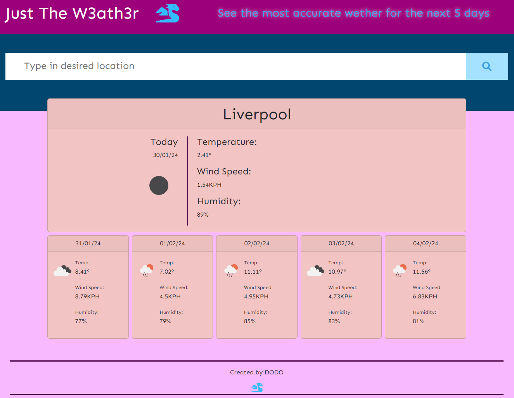

# Five-Day-Weather-App
A five day weather app, Java scripted

## Table of Contents
Project description
Link to deployed application
Overview 
Installation
Usage
Credits
License

## Project Description
This project is a 5 day waether web application, 

## Link to Deployed Application: 

## Overview
Using jQuery to dynamically update weather data based on search imput, data imputed as city, converted to coordinates and retereived from OpenWeatherMap API.
Also using moment.js to display the date and time.

 

## Installation
No installation is required.

## Usage
The user can type in a city from the UK and get weather data, ex: London, the Search will rememeber searc imputs and store them locally.

## Credits
Daniel D (AKA DODO) & Google Search

## License
MIT License 

Copyright (c) [2024] [<Daniel D>]